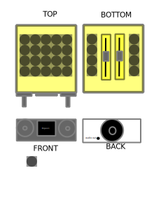

DIGEON Synthesizer

DIGEON (DIGital AccordiON?) attempts to be a mobile synth platform using
the bluepill board (STM32F103C 20KB RAM 64/128KB Flash), some buttons (initially a 4x4 button matrix),
an SSD1306 0.96 screen and some rotary encoders. Sound generation will be performed using the MOZZI library.

Initially sound is output using PB8 pin. For pins used, please take a look at the source code. Most stuff
can be found by looking at digeonsynth.ino file.

[example video 1](https://youtu.be/oJb8V_iWACQ)
[example video 2]()
1 pin PB8 Mozzi Sound Output
12 pins for 4digit 7segment lcd
10 pins for buttons
10 pins for rotary encoders